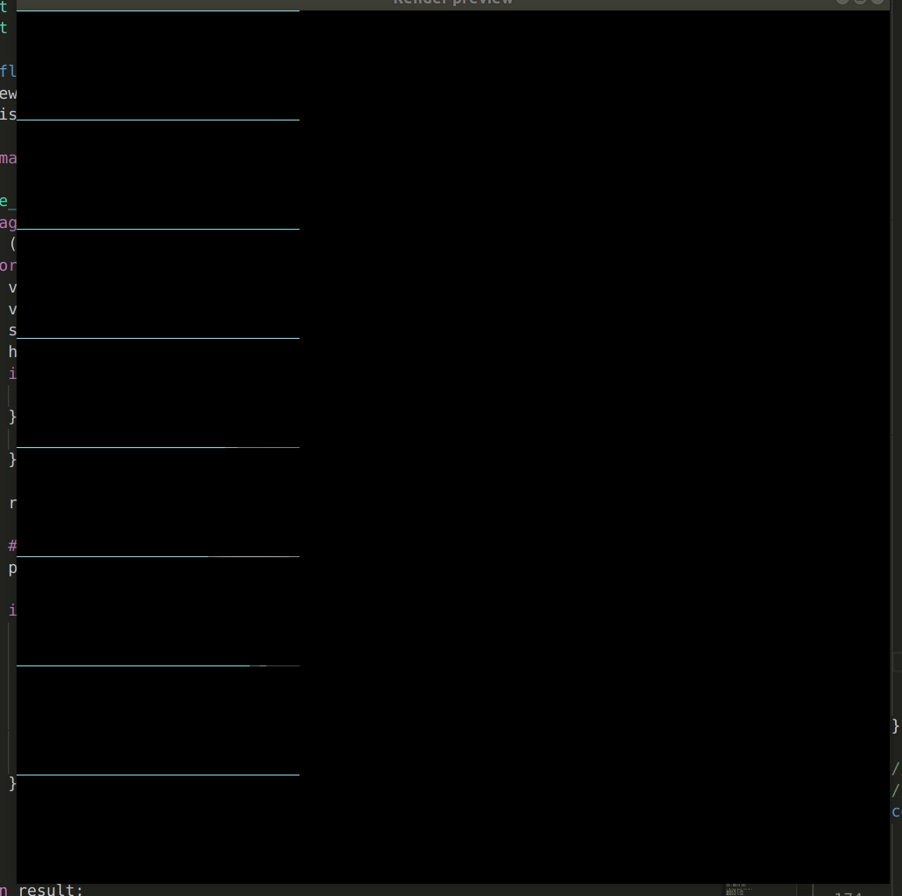
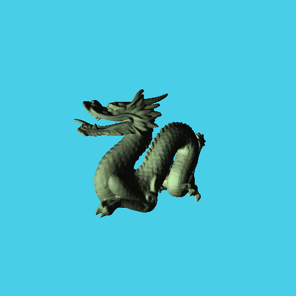
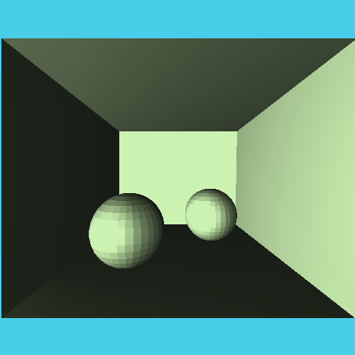

# project-3-starter
Project 3: raytracer

Takes in a `mrraytracer` scene JSON file and renders it to a PNG file. This implementation uses OpenMP for parallel computation of rendering rays: `sudo apt install libomp-dev`. 

## Group members:

* Josh Ferrara joshferrara@csu.fullerton.edu
* Stacey Frasier stacey726@csu.fullerton.edu

## model2json.py

Converts STL/OBJ files into `mrraytracer` compatible JSON files. Runs transformations across multiple threads. Run `model2json.py --help` for commands, or see the JSON files in the example folder for example command line usage.

## Examples

### Stanford Dragon

### Stanford Bunny (Low Poly)

### Cornell Box

